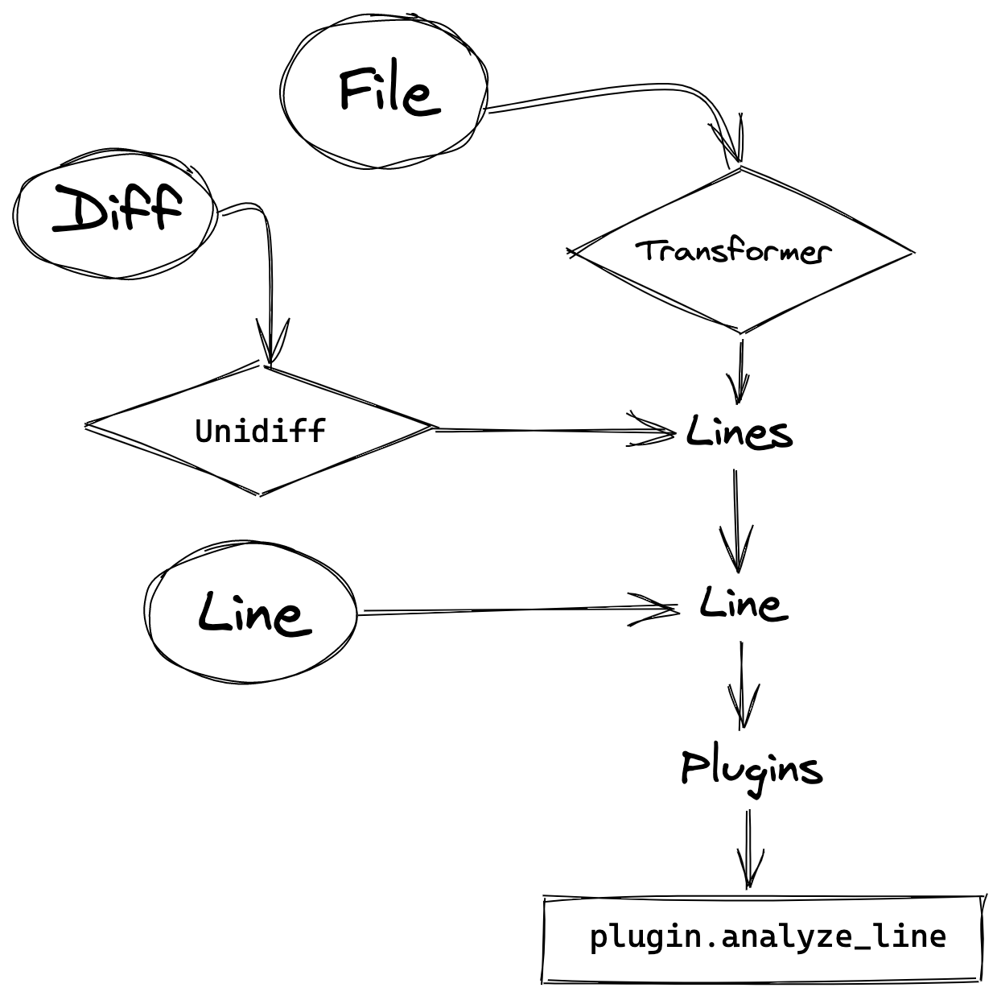

# Design

There are a few key components to understanding how this secret scanning engine works. This
document will describe the relevant pieces, and how they all cooperate together to find secrets
in your code.

## Layout

```
/detect_secrets               # This is where the main code lives
    /audit                    # Powers `detect-secrets audit`
    /core                     # Powers the detect-secrets engine
        /upgrades             # For version bumps that modify the baseline, instructions
                              # on how to apply automated upgrades are found here

    /filters                  # Functions that allow for filtering of false positives
    /plugins                  # All plugins live here, modularized.
    /transformers             # Converters that transform special file formats into line proxies
    /util                     # utility functionality
    main.py                   # Entrypoint for console use
    pre_commit_hook.py        # Entrypoint for pre-commit hook
    settings.py               # Global settings object

/test_data                    # Sample files used for testing purposes
/testing                      # Common logic used in test cases
/tests                        # Mirrors detect_secrets layout for all tests
```

## Components

### PotentialSecret

This lives at the very heart of the engine, and represents a line being flagged
for its potential to be a secret.

Since the detect-secrets engine is largely heuristics-based, it requires a human to read
its output at some point to determine false/true positives. Therefore, its representation
is tailored to support **high readability**. Its attributes represent values that you would
want to know (and keep track of) for each potential secret, including:

1. What is it?
2. How was it found?
3. Where is it found?
4. Is it a true/false positive?

We can see that the JSON dump clearly shows this.

```json
{
    "type": "Base64 High Entropy String",
    "filename": "test_data/config.yaml",
    "line_number": 5,
    "hashed_secret": "bc9160bc0ff062e1b2d21d2e59f6ebaba104f051",
    "is_secret": false,
    "is_verified": true
}
```

However, since it is designed for easy reading, we didn't want the baseline to be the single
file that contained all the secrets in a given repository. Therefore, we mask the secret by
hashing it with three core attributes:

1. The actual secret
2. The filepath where it was found
3. How the engine determined it was a secret

Any potential secret that has **all three values the same is equal**.

This means that the engine will flag the following cases as separate occurrences
to investigate:

- Same secret value, but present in different files
- Same secret value, caught by multiple plugins

Furthermore, this will **not** flag on every single usage of a given secret in a
given file, to minimize noise.

**Important Note:** The line number does not play a part in the identification
of a potential secret because code is expected to move around through continuous
iteration. However, through the `audit` tool, these line numbers are leveraged
to quickly identify the secret that was identified by a given plugin.

### SecretsCollection

A collection of `PotentialSecrets` are stored in a `SecretsCollection`. It operates like a
set with "extended" features -- that is, you can:

- Add secrets (via `scan_file` and `scan_diff`)
- Remove secrets (e.g. `SecretsCollection() - SecretsCollection()`)
- Compare equality (via `==` or `exactly_equals()`)
- Iterate through secrets
- `merge` collections (like set union)
- `trim` collections (to remove invalid entries: kinda like set intersection and left-join).

Since version 1.0, this was designed with *leanness* in mind -- that is, it does not have any
additional bells and whistles to it that does not directly contribute to its job being a
(somewhat intelligent) container for secrets.

### Settings

This is a global configuration object, that can be used to customize your scans to suit your
environment. With two identical settings, the scan results of the exact same files will result
in the exact same `SecretsCollection`.

> **Developer Note**: While this is technically a "global" variable, we use Python's `lru_cache`
  combined with a no-input function, to have better control over it. This allows for a singleton
  pattern with easy cleanup, so test pollution is reduced (see `tests.conftest.clear_cache`). This
  pattern is also frequently used around the codebase.
>
> Though this is a singleton object (which generally requires some care when deciding when to
  write to said object), as soon as the scan begins, all plugins and filters are initialized
  and cached. This essentially makes the configured settings a `frozendict` during execution.

As of version 1.0, the `Settings` object is responsible for:

1. Specifying plugin configurations
2. Specifying filter configurations

#### Plugins

**Plugins find secrets**. They are codified rules to scan an arbitrary string / line, and find a
potential secret value from it.

All plugins extend from `detect_secrets.plugins.base.BasePlugin`, which provides a common interface
for interacting with them. For more information on how to configure plugins, or even write your own,
check out the [plugins documentation](plugins.md).

Plugins are dynamically initialized through
`detect_secrets.core.plugins.util.get_mapping_from_secret_type_to_class`, and this is responsible
for importing all registered plugins (as specified in the `Settings` object). However, **you should
never need to interact with this directly!** If you need to initialize a plugin,
`detect_secrets.core.plugins.initialize` should suffice for your needs. e.g.

```python
from detect_secrets.core import plugins
plugin = plugins.initialize.from_plugin_classname('Base64HighEntropyString')
```

#### Filters

**Filters exclude false positives**. They are codified rules to skip scanning / alerting if a
a certain criteria is met.

Filters operate through a system of
[dependency injection](https://stackoverflow.com/questions/130794/what-is-dependency-injection)
-- this allows them to be **pure functions**, and depend on the system to provide them the variables
that they need to come to a decision. For more information on how to configure filters, or write
your own, check out the [filters documentation](filters.md).

All filters are dynamically initialized through `detect_secrets.settings.get_filters`, which
is responsible for importing all registered filters (as specified in the `Settings` object).
Additionally, if you want to learn more about the dependency injection framework we use, check out
`detect_secrets.util.inject`.

### Baseline

The baseline is a combination of the `Settings` used to create the result set, and the set of
`PotentialSecret`s found (represented in a `SecretsCollection`). This can be seen in
[`detect_secrets.core.baseline.format_for_output`](../detect_secrets/core/baseline.py).

The creation of baselines are fundamental to `detect-secrets` operations. They can be used to:

1. Block new secrets from entering the codebase (via `detect-secrets-hook`)
2. Provide a checklist for secrets to migrate off to more secure storage
3. Allow analysts to review, prioritize which secrets are important, as well as configure the
   scan settings to ensure a high signal-to-noise ratio (via `detect-secrets audit`).

Since a baseline's layout is essential to the tool's functionality, any changes to this layout
**must** specify an upgrade plan for backwards compatibility. See [upgrades](upgrades.md) for more
details. Furthermore, by using the `detect-secrets-hook`, it will automatically keep users'
baselines up-to-date to facilitate smooth transitions.

### Transformers

There are certain filetypes that fare better with custom parsing, rather than reading it
line-by-line. This is where transformers come in: **converting a file into a "line-proxy"**.

Line-proxies are an interesting concept, and can be best displayed in a (construed) example:

```yaml
token: |
    gX69YO4CvBsVjzAwYxdG
    yDd30t5+9ez31gKATtj4
```

In this YAML file, none of our current plugins will identify this as a secret.

- `KeywordDetector` will flag on `token`, but fail to find any secret value.
- `Base64HighEntropyString` will consider the two lines as individuals, and fail to find that
  it meets its pre-specified entropy limit.
- All `RegexBasedDetector` variants will not find the pattern they are looking for.

However, this is a simple example of a multi-line YAML file. In fact, if they were all on one-line,
the plugins would definitely catch it!

Hence, the transformer's job is to convert this YAML file into lines that the plugins are able
to identify. In this case, it would be converted to:

```yaml
token: "gX69YO4CvBsVjzAwYxdGyDd30t5+9ez31gKATtj4"
```

As you can see, this is a "line-proxy" -- it stores the necessary information in a line, however,
it is not the original line from the file.

> **Developer Note**: You may be wondering why we don't merely parse the YAML file, and iterate
  over the values in the resulting (flattened) dictionary. This is because of **line numbers**: to
  support easy identification of the secret during the `audit` process, we want to be able to
  preserve the location of where the secret was found. If we parsed it as a normal dictionary, all
  such information would be lost.

Transformers are also responsible for preserving comments in files, which are generally lost in
translation. For example, in the above scenario, we may want to bypass scanning for this token.
To do so, we can use the inline allowlisting feature as such:

```yaml
# Incorrect example, since this would be interpreted as part of the resulting string.
token: |
    gX69YO4CvBsVjzAwYxdG    # pragma: allowlist secret
    yDd30t5+9ez31gKATtj4

# Correct example
token: |    # pragma: allowlist secret
    gX69YO4CvBsVjzAwYxdG
    yDd30t5+9ez31gKATtj4
```

This information would be carried over to the line-proxy as such:

```yaml
token: "gX69YO4CvBsVjzAwYxdGyDd30t5+9ez31gKATtj4"   # pragma: allowlist secret
```

#### "Eager" Transformers

Unfortunately, file parsing is hard. There is always a delicate balance between scanning too much
(resulting in false positives), and not scanning enough (resulting in false negatives). "Eager"
transformers generally fall into the former case, and are only used if the other methods don't
come to a conclusive result.

As of version 1.0, there exists only one "eager" transformer:
`detect_secrets.transformers.config.EagerConfigTransformer`. This is responsible for trying to
transform config files (like `*.ini` files), since config files have a tendency not to have a
standard file extension.

For more information, check out the scanning logic, and how this differs from
`detect_secrets.transformers.config.ConfigTransformer`.

## Scanning

The scanning process is found in `detect_secrets.core.scan`, and is interfaced through
`SecretsCollection`. Visually, the processing flow is
as follows ([source](https://excalidraw.com/#json=5441829822529536,SgbuvKed2XzhzTO77_4uVg)):

<p align="center">

</p>

> **Developer Note**: While this flowchart displays the functionality for scanning diffs, this
  tool only exposes interfaces to scan files and/or lines. If you need to use diff scanning, check
  out [`detect-secrets-server`](https://github.com/Yelp/detect-secrets-server) or call the API
  yourself (via `SecretsCollection.scan_diff`).

## Audits

`detect-secrets audit` refers to a collection of features that allow for easier manual
analysis of created baselines. Some common use cases of this include:

- **Manually labelling secrets**, to distinguish between true and false positives
- **Comparing baselines**, to determine the effect of a certain configuration

Check out the [audit documentation](audit.md) for more details.
